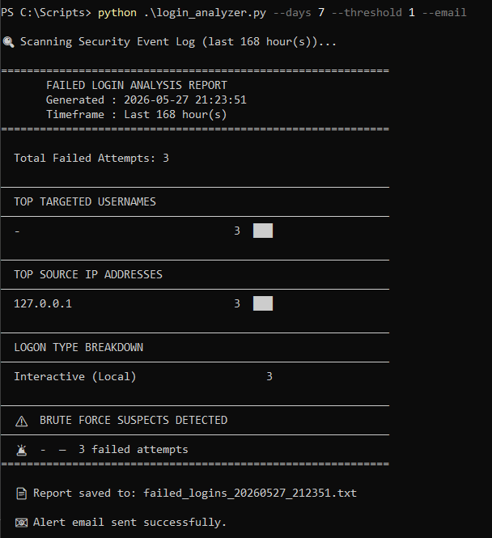
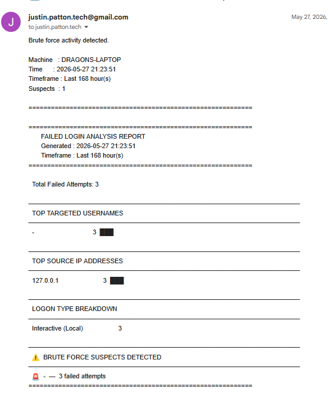
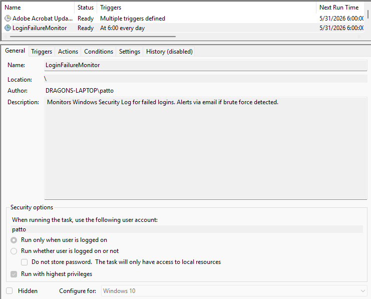
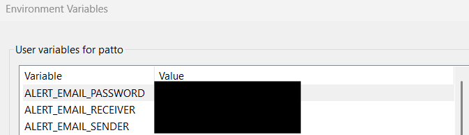

# Windows Security Event Log Analyzer

A Python automation tool that pulls Windows Security Event Log data,
identifies brute force login patterns, generates formatted reports,
and sends real-time email alerts — running on a daily schedule with
no manual intervention.

Built as a practical SOC skill demonstration: real event log data,
real alerting logic, real credential hygiene.

---

## The Problem This Solves

Windows logs every failed login as **Event ID 4625**. In a normal
environment, these accumulate quietly in the background — and buried
in the noise are the patterns that matter: the same account getting
hammered from multiple IPs, RemoteInteractive failures at 3 AM, guest
accounts taking dozens of hits from an internal host.

Nobody's watching that log manually. This tool watches it automatically.

---

## What It Does

- Pulls Event ID 4625 (Failed Logon) from the Windows Security Log
- Analyzes failures by **username**, **source IP**, and **logon type**
- Maps logon type codes to readable labels (Network, RDP, Interactive)
- Flags accounts exceeding a configurable **brute force threshold**
- Generates a timestamped, formatted `.txt` report on every run
- Sends an **automated Gmail SMTP alert** when suspects are detected
- Runs **daily at 6 AM via Windows Task Scheduler** — fully automated
- All credentials stored as **Windows environment variables** —
  never hardcoded, never in version control

This directly maps to what a SIEM correlation rule does at the
platform level — except built from scratch against the raw event log.
The detection logic mirrors [MITRE ATT&CK T1110 — Brute Force](https://attack.mitre.org/techniques/T1110/).

---

## Screenshots

### Terminal Output

*Running `--days 7 --threshold 1 --email` — formatted report output
with suspect flagging, file save confirmation, and email delivery
confirmation in a single terminal session.*

### Email Alert

*Automated Gmail alert showing machine name, timestamp, timeframe,
and full report body — delivered before the workday starts.*

### Task Scheduler

*Daily 6 AM scheduled job configured with highest privileges,
running automatically with no manual execution.*

### Environment Variables

*Gmail credentials stored as Windows user environment variables.
Values redacted. No credentials exist anywhere in the codebase
or commit history.*

---

## Project Structure
windows-security-log-analyzer/
├── login_analyzer.py        # Core logic: pull, analyze, report, alert
├── setup_env.example.ps1    # Credential setup template (placeholders only)
├── requirements.txt         # No third-party dependencies — pure stdlib
├── .gitignore               # Excludes reports, real setup_env.ps1, credentials
├── SAMPLE_REPORT.txt        # Sanitized example of generated output
├── screenshots/             # Visual proof of execution
└── docs/
└── setup_guide.md       # Full setup and deployment instructions

---

## Quick Start

**1. Clone the repo**
```powershell
git clone https://github.com/YOUR_USERNAME/windows-security-log-analyzer.git
cd windows-security-log-analyzer
```

**2. Verify access**
```powershell
# Must run PowerShell as Administrator
Get-WinEvent -LogName Security -MaxEvents 5 | Select-Object TimeCreated, Id
```

**3. Set credentials**

Copy `setup_env.example.ps1`, fill in your Gmail address and App
Password, run it once in admin PowerShell, then delete the copy.
See `docs/setup_guide.md` for the full Gmail App Password walkthrough.

**4. Run it**
```powershell
# Default: last 24 hours, threshold of 5
python login_analyzer.py

# With email alert enabled
python login_analyzer.py --hours 24 --threshold 5 --email
```

**5. Schedule it**

See `docs/setup_guide.md` → Step 5 for the full Task Scheduler
configuration.

---

## CLI Options

```powershell
python login_analyzer.py [--hours N | --days N] [--threshold N] [--email]
```

| Flag | Default | Description |
|---|---|---|
| `--hours N` | `24` | Scan the last N hours |
| `--days N` | — | Scan the last N days (overrides `--hours`) |
| `--threshold N` | `5` | Failures before flagging an account |
| `--email` | off | Send alert if suspects are found |

`--email` only triggers when suspects exceed the threshold.
A clean scan sends nothing.

---

## Security Design

**No third-party dependencies.** The entire tool runs on the Python
standard library — `subprocess`, `smtplib`, `argparse`, `json`,
`os`, `collections`, `datetime`. Nothing to audit beyond the script
itself.

**Credentials never touch the codebase.** Gmail credentials are
loaded exclusively from Windows environment variables using
`os.environ.get()`. The setup script that writes those variables
is run once and deleted. `.gitignore` explicitly blocks `setup_env.ps1`
from being committed even if someone forgets.

**No real log data in version control.** Generated reports are named
`failed_logins_*.txt` and blocked by `.gitignore`. `SAMPLE_REPORT.txt`
contains entirely fictional data from an isolated test environment.

**Email only fires on real detections.** The `--email` flag is
opt-in, and even when passed, the SMTP call only executes when
suspects actually exceed the threshold. A clean run produces no
network traffic beyond the log query.

---

## SOC Relevance

| This Tool | SOC / SIEM Equivalent |
|---|---|
| Pulls Event ID 4625 | Log ingestion from Windows endpoints |
| Aggregates by user/IP/type | Field extraction and normalization |
| Threshold-based flagging | Correlation rule: N failures in T time |
| Formatted report output | Structured alert for shift handoff |
| SMTP email delivery | Alert → ticketing system notification |
| Daily scheduled execution | Continuous monitoring pipeline |

---

## Author

**Justin Patton**
CompTIA Security+ · Google Cybersecurity · Google IT Support

[LinkedIn](https://www.linkedin.com/in/pattonjl/) ·
[GitHub](https://www.github.com/PattonJL)
